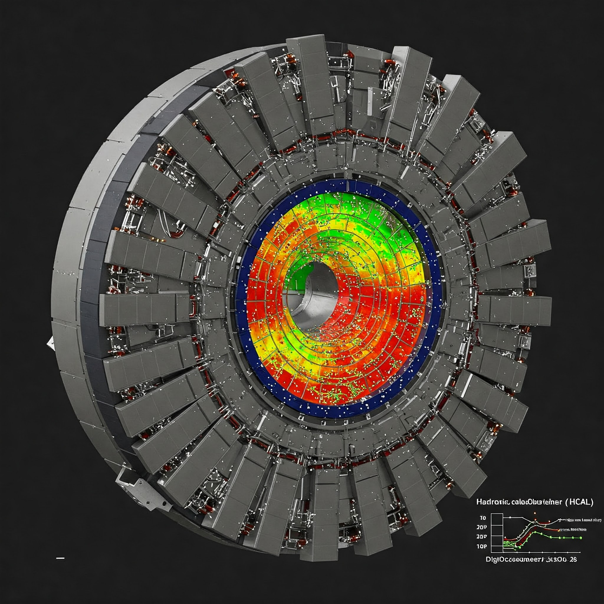
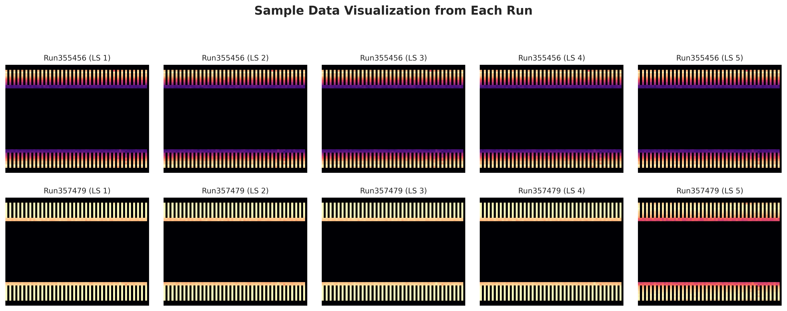

# Vision Transformer Based Classification

## Project Overview
This project implements a machine learning model using Vision Transformer (ViT) architecture to classify images based on their dataset origins. The model can determine which dataset an image belongs to by analyzing visual patterns and characteristics unique to each data source.

## HCAL DigiOccupancy Dataset from CMS Detector


The project uses synthetic data representing DigiOccupancy (hit multiplicity) values from the Hadronic Calorimeter (HCAL) at the Large Hadron Collider's Compact Muon Solenoid (CMS) detector. Key characteristics:

- Data represents particle "hits" detected in the HCAL during proton-proton collisions
- Structured as (10000,64,72) arrays representing (Lumi-sections, ieta, iphi)
- ieta: pseudorapidity coordinate (approximately azimuthal angle)
- iphi: polar angle coordinate
- Values represent hit density across the cylindrical HCAL detector
- Contains many zero-valued entries throughout the coordinates


The visualizations above represent sample data from different runs (Run355456 and Run357479), with each run containing multiple labeled samples (LS 1-5). The colored bands at top and bottom show hit densities across detector regions.

## Background
Vision Transformers have recently emerged as powerful alternatives to convolutional neural networks (CNNs) for computer vision tasks. This project explores both traditional Vision Transformer implementations and Mixture-of-Experts (MoE) Vision Transformer approaches for dataset classification.

## Model Performance

The model has been evaluated using standard metrics:

- **Accuracy**: Training and validation accuracy curves show rapid convergence to ~99% accuracy within the first few epochs.
- **ROC Curve**: The model achieves an area under the curve (AUC) of 1.00, indicating perfect classification performance.
- **Loss**: Both training and validation loss curves show quick decrease and stabilization at near-zero values.

## Approaches

### Traditional Vision Transformer
The traditional ViT approach uses a standard transformer architecture adapted for image classification:
- Image patches are treated as sequence tokens
- Self-attention mechanisms capture relationships between different parts of images
- Classification is performed using a specialized [CLS] token

### Mixture-of-Experts (MoE) Vision Transformer
The MoE approach enhances the standard ViT by:
- Incorporating multiple specialized "expert" networks
- Using a gating mechanism to dynamically route inputs to appropriate experts
- Allowing more efficient and effective learning of diverse visual patterns

## Requirements

```
numpy>=1.20.0
matplotlib>=3.4.0
seaborn>=0.11.0
torch>=1.9.0
torchvision>=0.10.0
timm>=0.5.4
tqdm>=4.62.0
scikit-learn>=0.24.0
```

### Installation
```bash
git clone https://github.com/ktdjiren/ML4DQM-ViT-.git
pip install -r requirements.txt
```


## Results and Findings

The model demonstrates excellent performance in distinguishing between different dataset sources. Key findings include:
- High accuracy achieved with minimal training epochs
- Perfect ROC curve (AUC = 1.00) indicating strong discriminative capability
- Similar performance between traditional and MoE approaches, with MoE potentially offering better scaling properties

